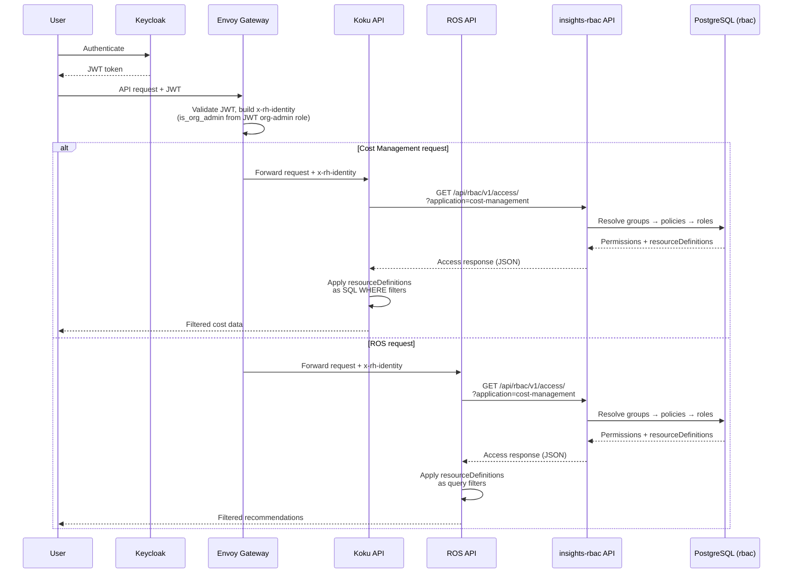
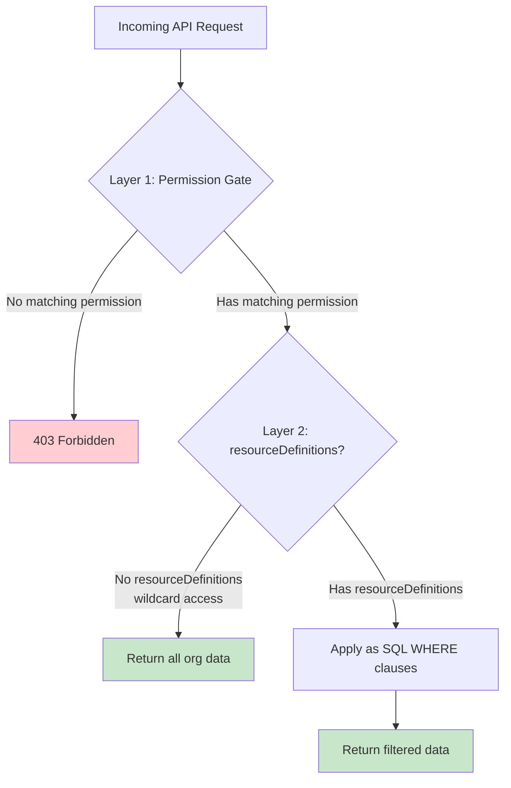
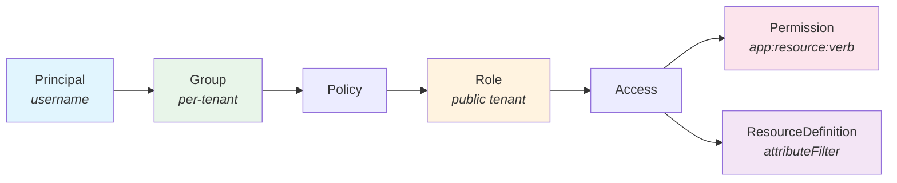
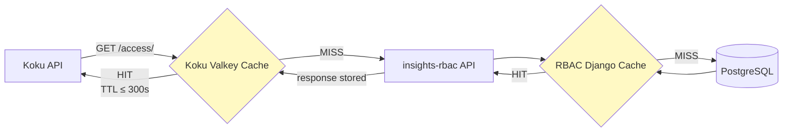
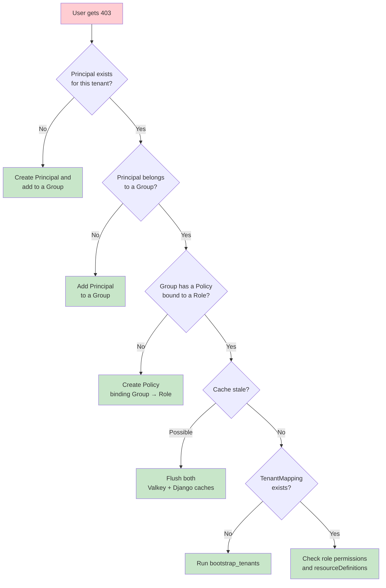
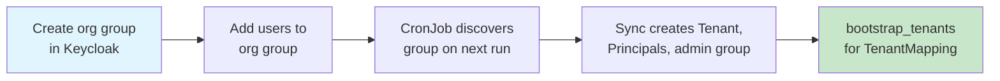
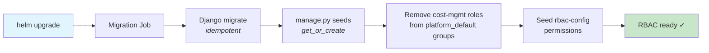

# RBAC Setup and Operations Guide

Role-Based Access Control (RBAC) configuration, user management, and troubleshooting for Cost Management On-Premise.

## Breaking Changes

> **Chart ≥ 0.2.20**: `jwtAuth.orgAdminUsernames` has been removed.
> Admin status is now determined by the Keycloak **org-admin** realm role, which
> is assigned automatically when `orgAdmin: true` is set on a user in
> `jwtAuth.realmUsers`. If you previously set `orgAdminUsernames`, migrate those
> usernames into `jwtAuth.realmUsers` entries with `orgAdmin: true` and re-run
> `deploy-rhbk.sh -f <values.yaml>`.
>
> Similarly, `bootstrapAdmin.username`, `bootstrapAdmin.orgId`, and
> `bootstrapAdmin.accountNumber` are now derived from the first `orgAdmin: true`
> entry in `jwtAuth.realmUsers` — explicit values in `bootstrapAdmin` are no
> longer required.

## Table of Contents

- [Breaking Changes](#breaking-changes)
- [Overview](#overview)
- [Architecture](#architecture)
- [Prerequisites](#prerequisites)
- [How Authorization Works](#how-authorization-works)
- [Seeded Roles and Permissions](#seeded-roles-and-permissions)
- [User and Group Management](#user-and-group-management)
- [Creating Custom Access Policies](#creating-custom-access-policies)
- [Cache Behavior](#cache-behavior)
- [Troubleshooting](#troubleshooting)
- [Operational Runbook](#operational-runbook)

---

## Overview

Cost Management On-Premise uses [insights-rbac](https://github.com/RedHatInsights/insights-rbac) as its authorization backend. Every API request to **Koku** and **ROS (Resource Optimization Service)** passes through insights-rbac to determine what resources the user can access.

Key properties:
- Authorization is **role-based**, not attribute-based
- `is_org_admin` defaults to **true for the `admin` user** via `jwtAuth.realmUsers` (where `orgAdmin: true`). This triggers the `admin_default` group mechanism, granting Cost Administrator permissions automatically. Additional users can be added to `realmUsers`, or `orgAdmin` can be set to `false` for the most restrictive posture where all access requires explicit RBAC group membership (see [Identity Header](#identity-header))
- Permissions are scoped by `resourceDefinitions` (e.g., specific clusters, namespaces)
- The system seeds 5 built-in roles covering common access patterns
- RBAC is **always enabled** for both Koku and ROS — there is no toggle to disable it

---

## Architecture



1. User authenticates via Keycloak and obtains a JWT
2. Envoy validates the JWT and constructs the `x-rh-identity` header (`is_org_admin` derived from the JWT `org-admin` realm role)
3. The request is routed to either Koku or ROS, depending on the API path
4. Both services call insights-rbac's `/api/rbac/v1/access/` endpoint with the forwarded identity
5. insights-rbac resolves the user's groups → policies → roles → permissions
6. The backend service applies any `resourceDefinitions` as query filters

### Services Protected by RBAC

| Service | API Path Prefix | RBAC Application | Notes |
|---------|----------------|------------------|-------|
| **Koku** (Cost Management) | `/api/cost-management/` | `cost-management` | Reports, tags, forecasts, cost models, settings |
| **ROS** (Resource Optimization) | `/api/ros/` | `cost-management` | Recommendations, system ratings |
| **insights-rbac** (IAM) | `/api/rbac/` | `rbac` | Role, group, policy management |

Koku and ROS use the `cost-management` RBAC application and permission set. A user with `cost-management:openshift.cluster:read` permission can access both Koku OCP reports and ROS recommendations for the authorized clusters.

The insights-rbac admin API is exposed at `/api/rbac/` through the Envoy gateway with the same JWT authentication and X-Rh-Identity injection as all other routes. Access to RBAC management endpoints (creating roles, managing groups) is governed by `rbac:*` permissions, which are seeded by `manage.py seeds` from the insights-rbac image.

---

## Prerequisites

Before configuring RBAC, ensure:

1. **insights-rbac is deployed** — the Helm chart always deploys it as part of the cost-onprem stack
2. **Migration job completed** — verify with:
   ```bash
   kubectl get jobs -n <namespace> | grep rbac-migration
   ```
3. **RBAC API is healthy**:
   ```bash
   kubectl exec -it deployment/cost-onprem-rbac-api -n <namespace> -- \
     curl -s http://localhost:8000/api/rbac/v1/status/
   ```
4. **Keycloak realm is configured** — users must exist in the Keycloak realm that the Envoy gateway validates against
5. **Valkey is running** — required as Celery broker for RBAC worker

---

## How Authorization Works

### Two-Layer Authorization in Koku



**Layer 1: Permission Gate (DRF)**

Koku checks that the user has at least one matching permission for the endpoint. For example, the OpenShift reports endpoint requires `cost-management:openshift.cluster:read` or `cost-management:openshift.project:read`.

If no matching permission exists → **HTTP 403**.

**Layer 2: Query Filtering**

If the user's permission includes `resourceDefinitions`, Koku applies them as SQL WHERE clauses:

- `operation: "equal"` with `value: "cluster-alpha"` → restricts to that specific cluster
- `operation: "in"` with `value: ["payment", "frontend"]` → restricts to those namespaces
- No `resourceDefinitions` (wildcard) → all data visible within the org

### Identity Header

The `x-rh-identity` header is constructed by the Envoy gateway and contains:

```json
{
  "org_id": "<from-keycloak>",
  "identity": {
    "org_id": "<from-keycloak>",
    "account_number": "<from-keycloak>",
    "type": "User",
    "user": {
      "username": "<from-jwt>",
      "email": "<from-jwt>",
      "is_org_admin": true
    }
  },
  "entitlements": {
    "cost_management": {
      "is_entitled": true
    }
  }
}
```

`is_org_admin` is `true` when the JWT contains the `org-admin` realm role, `false` otherwise.

**Important**: `is_org_admin` is derived from the Keycloak **`org-admin` realm role**. The Envoy gateway reads `realm_access.roles` from the JWT and sets `is_org_admin: true` when the `org-admin` role is present. Keycloak is the single source of truth for admin status.

For initial provisioning, `deploy-rhbk.sh -f values.yaml` reads `jwtAuth.realmUsers` and assigns the `org-admin` role to users with `orgAdmin: true`:

```yaml
jwtAuth:
  realmUsers:
    - username: admin
      password: admin
      orgAdmin: true      # assigned "org-admin" realm role → is_org_admin=true
    - username: viewer
      password: viewer
      orgAdmin: false     # no org-admin role → standard user
```

After deployment, admin status can be managed directly in the Keycloak admin console by assigning or removing the `org-admin` realm role -- no `helm upgrade` required. See the [PoC Analysis](https://gist.github.com/jordigilh/c81c73ba411637e24a30acd6a743e5fb) for security rationale.

### Production Hardening (FedRAMP)

**Brute-force protection (AC-7)**: RHBK includes built-in brute-force detection that is **disabled by default** in development realms. Production and FedRAMP deployments **must** enable it:

1. In the Keycloak admin console, navigate to **Realm Settings → Security Defenses → Brute Force Detection**.
2. Enable **Permanent Lockout** or configure a lockout duration and failure threshold.
3. Alternatively, configure via the `KeycloakRealmImport` CR:

```yaml
spec:
  realm:
    bruteForceProtected: true
    permanentLockout: false
    maxFailureWaitSeconds: 900
    failureFactor: 5
    waitIncrementSeconds: 60
```

**Password policy (IA-5)**: The default `realmUsers` in `values.yaml` use simple passwords for development convenience. Production deployments must:

- Change all passwords in `jwtAuth.realmUsers` before deployment.
- Configure a Keycloak password policy (Realm Settings → Authentication → Password Policy) that enforces organizational complexity requirements.

**TLS (SC-8)**: The `deploy-rhbk.sh` script uses `curl -sk` (skip TLS verification) for test/dev environments. Production deployments must configure a trusted CA bundle and use `--cacert /path/to/ca-bundle.crt`.

---

## Seeded Roles and Permissions

The migration job seeds the following roles into the `public` tenant:

| Role | Permissions | Use Case |
|------|------------|----------|
| **Cost Administrator** | `cost-management:*:*` | Full access to all cost data and settings |
| **Cost Price List Administrator** | `cost_model:*`, `settings:*` | Manage cost models and settings |
| **Cost Price List Viewer** | `cost_model:read`, `settings:read` | View cost models and settings |
| **Cost Cloud Viewer** | `aws.*:*`, `azure.*:*`, `gcp.*:*` | View cloud provider cost data |
| **Cost OpenShift Viewer** | `openshift.cluster:*` | View OpenShift cost data |

### Permission Format

Permissions follow the pattern: `cost-management:<resource_type>:<verb>`

Available resource types:
- `openshift.cluster`, `openshift.node`, `openshift.project`
- `aws.account`, `aws.organizational_unit`
- `azure.subscription_guid`
- `gcp.account`, `gcp.project`
- `cost_model`, `settings`
- `*` (wildcard — all resources)

Available verbs: `read`, `write`, `*`

---

## User and Group Management

### Creating a User in Keycloak

Users are managed in Keycloak. Each user must have:
- `org_id` attribute (determines which tenant/org they belong to)
- `account_number` attribute (customer account identifier)

### Assigning Roles via Groups

RBAC uses the following hierarchy:



To grant a user access:

1. **Create a Group** (or use an existing one)
2. **Create a Policy** binding the group to a role
3. **Add the user as a principal** to the group

### Example: Grant Full Admin Access

```bash
RBAC_POD=$(kubectl get pod -l app.kubernetes.io/component=rbac-api -n <namespace> -o jsonpath='{.items[0].metadata.name}')

kubectl exec -it $RBAC_POD -n <namespace> -- python manage.py shell <<'EOF'
from api.models import Tenant
from management.models import Group, Policy, Role, Principal

tenant = Tenant.objects.get(org_id='<your-org-id>')
public_tenant = Tenant.objects.get(tenant_name='public')

# Get the Cost Administrator role
admin_role = Role.objects.get(name='Cost Administrator', tenant=public_tenant)

# Create group
group, _ = Group.objects.get_or_create(
    name='Cost Admins', tenant=tenant,
    defaults={'description': 'Users with full cost management access'}
)

# Create policy binding group to role
policy, _ = Policy.objects.get_or_create(
    name='Cost Admin Policy', tenant=tenant, group=group
)
policy.roles.add(admin_role)

# Add user as principal
principal, _ = Principal.objects.get_or_create(
    username='admin-user', tenant=tenant
)
group.principals.add(principal)

print(f"User 'admin-user' now has Cost Administrator access")
EOF
```

### Example: Namespace-Scoped Access

Grant a user access only to specific namespaces across all clusters:

```bash
kubectl exec -it $RBAC_POD -n <namespace> -- python manage.py shell <<'EOF'
from api.models import Tenant
from management.models import (
    Group, Policy, Role, Access, Permission,
    ResourceDefinition, Principal
)

tenant = Tenant.objects.get(org_id='<your-org-id>')
public_tenant = Tenant.objects.get(tenant_name='public')

# Create a custom role with namespace filter
role, _ = Role.objects.get_or_create(
    name='Payment Team Viewer', tenant=public_tenant,
    defaults={
        'description': 'View payment namespace costs only',
        'system': False, 'version': 2
    }
)

# Add openshift.project:read permission with resource definition
perm = Permission.objects.get(
    application='cost-management',
    resource_type='openshift.project', verb='read'
)
access, _ = Access.objects.get_or_create(
    role=role, permission=perm, defaults={'tenant': public_tenant}
)

# Filter to "payment" namespace only
ResourceDefinition.objects.get_or_create(
    access=access, tenant=public_tenant,
    defaults={'attributeFilter': {
        'key': 'cost-management.openshift.project',
        'operation': 'in',
        'value': ['payment']
    }}
)

# Create group and bind
group, _ = Group.objects.get_or_create(
    name='Payment Team', tenant=tenant,
    defaults={'description': 'Payment namespace viewers'}
)
policy, _ = Policy.objects.get_or_create(
    name='Payment Team Policy', tenant=tenant, group=group
)
policy.roles.add(role)

# Add user
principal, _ = Principal.objects.get_or_create(
    username='payment-user', tenant=tenant
)
group.principals.add(principal)

print("User 'payment-user' now has read access to payment namespace only")
EOF
```

### Example: Cluster-Scoped Access

Grant a user access to a specific cluster:

```bash
kubectl exec -it $RBAC_POD -n <namespace> -- python manage.py shell <<'EOF'
from api.models import Tenant
from management.models import (
    Group, Policy, Role, Access, Permission,
    ResourceDefinition, Principal
)

tenant = Tenant.objects.get(org_id='<your-org-id>')
public_tenant = Tenant.objects.get(tenant_name='public')

role, _ = Role.objects.get_or_create(
    name='Cluster Alpha Ops', tenant=public_tenant,
    defaults={
        'description': 'View cluster-alpha costs only',
        'system': False, 'version': 2
    }
)

perm = Permission.objects.get(
    application='cost-management',
    resource_type='openshift.cluster', verb='read'
)
access, _ = Access.objects.get_or_create(
    role=role, permission=perm, defaults={'tenant': public_tenant}
)

ResourceDefinition.objects.get_or_create(
    access=access, tenant=public_tenant,
    defaults={'attributeFilter': {
        'key': 'cost-management.openshift.cluster',
        'operation': 'equal',
        'value': 'my-cluster-id'
    }}
)

group, _ = Group.objects.get_or_create(
    name='Cluster Alpha Team', tenant=tenant,
    defaults={'description': 'Cluster alpha operations team'}
)
policy, _ = Policy.objects.get_or_create(
    name='Cluster Alpha Policy', tenant=tenant, group=group
)
policy.roles.add(role)

principal, _ = Principal.objects.get_or_create(
    username='cluster-ops-user', tenant=tenant
)
group.principals.add(principal)

print("User 'cluster-ops-user' now has read access to cluster-alpha only")
EOF
```

**Known limitation**: Users with cluster-scoped access can browse their data via auto-injection, but explicit `?filter[cluster]=<id>` query parameters may return 403 due to a format mismatch in Koku's filter comparison logic.

---

## Creating Custom Access Policies

### Resource Definition Operations

| Operation | Value Type | Example | Behavior |
|-----------|-----------|---------|----------|
| `equal` | string | `"cluster-alpha"` | Exact match on single value |
| `in` | list | `["payment", "frontend"]` | Match any value in list |

### Resource Definition Keys

| Key | Filters On |
|-----|-----------|
| `cost-management.openshift.cluster` | OCP cluster identifier |
| `cost-management.openshift.node` | OCP node name |
| `cost-management.openshift.project` | OCP namespace/project name |
| `cost-management.aws.account` | AWS account ID |
| `cost-management.azure.subscription_guid` | Azure subscription GUID |
| `cost-management.gcp.account` | GCP billing account |
| `cost-management.gcp.project` | GCP project ID |

### Important Notes

1. **Custom roles must be created via Django ORM** — the RBAC REST API gates custom role creation behind the `ROLE_CREATE_ALLOW_LIST` environment variable, which is empty by default (matching SaaS behavior). The API returns `"Custom roles cannot be created for cost-management"` for any application not on this list. Django ORM bypasses this API validation layer. To enable REST-based custom role creation, set `ROLE_CREATE_ALLOW_LIST=cost-management` on the RBAC API deployment.
2. **Roles are created in the `public` tenant** — they are shared across all orgs
3. **Groups, policies, and principals are per-tenant** — each org has its own assignments
4. **Principal usernames must match Keycloak usernames** — RBAC resolves the principal by the `username` field from the identity header

---

## Cache Behavior



### RBAC Response Cache (Koku side)

Koku caches responses from the RBAC `/access/` endpoint in Valkey:
- **TTL**: 300 seconds (5 minutes) by default
- **Key**: Based on user identity + application
- **Effect**: Permission changes take up to 5 minutes to propagate

### Django Cache (insights-rbac side)

insights-rbac uses Django's cache framework for internal query results.

### Flushing Caches

> **Note:** The manual cache flush workflow below is a known UX gap. A dedicated script or Helm hook for automated cache invalidation is planned as a follow-up improvement. For most use cases, the TTL-based expiry (300s on the Koku side) is sufficient without manual intervention.

After making permission changes that need immediate effect:

```bash
# 1. Flush insights-rbac Django cache
RBAC_POD=$(kubectl get pod -l app.kubernetes.io/component=rbac-api -n <namespace> -o jsonpath='{.items[0].metadata.name}')
kubectl exec -it $RBAC_POD -n <namespace> -- \
  python manage.py shell -c "from django.core.cache import cache; cache.clear(); print('RBAC cache cleared')"

# 2. Flush Koku's RBAC cache in Valkey
VALKEY_POD=$(kubectl get pod -l app.kubernetes.io/component=valkey -n <namespace> -o jsonpath='{.items[0].metadata.name}')
kubectl exec -it $VALKEY_POD -n <namespace> -- valkey-cli FLUSHALL

echo "Both caches flushed — permission changes are now active"
```

**Warning**: `FLUSHALL` clears ALL Valkey data including Celery task metadata. In production, consider using targeted key deletion instead.

---

## Troubleshooting

### User Gets 403 on All Endpoints

**Symptoms**: Authenticated user receives HTTP 403 on cost report endpoints.

**Diagnosis**:

```bash
# 1. Check what RBAC returns for this user
RBAC_POD=$(kubectl get pod -l app.kubernetes.io/component=rbac-api -n <namespace> -o jsonpath='{.items[0].metadata.name}')

# Create identity header for the user
# Set IS_ORG_ADMIN to true for admin users (those with the org-admin Keycloak role), false otherwise
IS_ORG_ADMIN=false
IDENTITY=$(echo -n "{\"org_id\":\"<org>\",\"identity\":{\"org_id\":\"<org>\",\"account_number\":\"<acct>\",\"type\":\"User\",\"user\":{\"username\":\"<user>\",\"email\":\"<email>\",\"is_org_admin\":${IS_ORG_ADMIN}}},\"entitlements\":{\"cost_management\":{\"is_entitled\":true}}}" | base64 | tr -d '\n')

# Query RBAC access endpoint
kubectl exec -it $RBAC_POD -n <namespace> -- \
  curl -s -H "X-Rh-Identity: $IDENTITY" \
  "http://localhost:8000/api/rbac/v1/access/?application=cost-management" | python3 -m json.tool
```

**Common causes**:



### User Sees All Data (No Filtering)

**Symptoms**: User sees data from clusters/namespaces they shouldn't have access to.

**Diagnosis**:
1. Check if the user's role has `*:*` wildcard permissions
2. Check if `platform_default` groups grant broad access
3. Verify `resourceDefinitions` are correctly configured

```bash
kubectl exec -it $RBAC_POD -n <namespace> -- python manage.py shell <<'EOF'
from management.models import Access, ResourceDefinition
from api.models import Tenant

public = Tenant.objects.get(tenant_name='public')
for access in Access.objects.filter(tenant=public):
    rds = ResourceDefinition.objects.filter(access=access)
    if rds.exists():
        for rd in rds:
            print(f"Role: {access.role.name} | Perm: {access.permission} | Filter: {rd.attributeFilter}")
    else:
        print(f"Role: {access.role.name} | Perm: {access.permission} | Filter: WILDCARD (all data)")
EOF
```

### RBAC API Returns 500

**Symptoms**: Koku logs show 500 responses from RBAC, users get 424.

**Diagnosis**:
```bash
# Check RBAC API logs
kubectl logs deployment/cost-onprem-rbac-api -n <namespace> --tail=50

# Check RBAC worker logs
kubectl logs deployment/cost-onprem-rbac-worker -n <namespace> --tail=50

# Verify DB connectivity
kubectl exec -it $RBAC_POD -n <namespace> -- \
  python manage.py shell -c "from django.db import connection; connection.ensure_connection(); print('DB OK')"
```

### TenantNotBootstrappedError

**Symptoms**: RBAC returns errors about missing `TenantMapping`.

**Fix**:
```bash
kubectl exec -it $RBAC_POD -n <namespace> -- \
  python manage.py bootstrap_tenants --all -v 2
```

---

## Operational Runbook

### Adding a New Organization



The Keycloak-to-RBAC sync CronJob automatically discovers organizations from Keycloak groups. To add a new org:

1. **Create the org group in Keycloak** with the configured prefix (default: `org-`):
   - Group name: `org-<orgId>` (e.g., `org-neworg999`)
   - Group attributes: `org_id` = `<orgId>`, `account_number` = `<accountNumber>`
   - Sub-group: `org-admin` (members get Cost Administrator access)

2. **Add users to the group**:
   - Add users as members of the org group
   - Add admin users to the `org-admin` sub-group

3. **Wait for the next CronJob run** (default: every 15 minutes), or trigger manually:
   ```bash
   kubectl create job --from=cronjob/<release>-rbac-keycloak-sync manual-sync -n <namespace>
   ```

The sync CronJob handles Tenant creation, Principal upsert, admin group management, orphan pruning, and `bootstrap_tenants` per-org automatically.

> **Note**: If using `deploy-rhbk.sh`, add users to `jwtAuth.realmUsers` with the new `orgId` and re-run `deploy-rhbk.sh -f values.yaml`. The script provisions users and org groups automatically.

### Listing All Users and Their Access

```bash
kubectl exec -it $RBAC_POD -n <namespace> -- python manage.py shell <<'EOF'
from management.models import Principal, Group

for p in Principal.objects.all():
    groups = Group.objects.filter(principals=p)
    group_names = [g.name for g in groups]
    print(f"User: {p.username} | Tenant: {p.tenant.org_id} | Groups: {group_names}")
EOF
```

### Revoking Access

```bash
kubectl exec -it $RBAC_POD -n <namespace> -- python manage.py shell <<'EOF'
from management.models import Principal, Group
from api.models import Tenant

tenant = Tenant.objects.get(org_id='<org-id>')
principal = Principal.objects.get(username='<username>', tenant=tenant)
group = Group.objects.get(name='<group-name>', tenant=tenant)

group.principals.remove(principal)
print(f"Removed {principal.username} from {group.name}")
EOF
```

After revoking, flush caches (see [Cache Behavior](#cache-behavior)).

### Upgrading RBAC



The migration job runs automatically on `helm upgrade`. It is idempotent:
- Migrations are safe to re-run
- Permission/role seeding uses `get_or_create`
- admin_default group creation is idempotent

Verify after upgrade:
```bash
# Check migration job completed
kubectl get jobs -n <namespace> | grep rbac-migration

# Verify roles are seeded
kubectl exec -it $RBAC_POD -n <namespace> -- \
  python manage.py shell -c "from management.models import Role; print(f'Roles: {Role.objects.count()}')"
```
